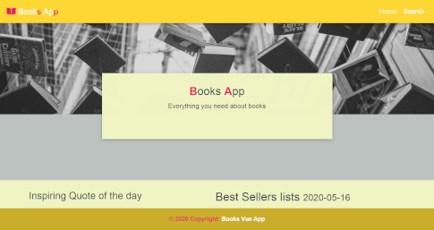

<!-- PROJECT LOGO -->
<br />
<p align="center">
  <a href="https://github.com/mateuszlubianka1993/books-vue">
    
  </a>

  <h3 align="center">Books App Vue</h3>

  <p align="center">
    Simple Books App.
    <br />
    <br />
    <a href="https://books-vue.netlify.app/">View Demo</a>
  </p>
</p>


<!-- TABLE OF CONTENTS -->
## Table of Contents

* [About the Project](#about-the-project)
  * [Built With](#built-with)
* [Usage](#usage)
* [Screens](#screens)
* [Getting Started](#getting-started)
  * [Prerequisites](#prerequisites)
  * [Installation](#installation)
* [Contact](#contact)


<!-- ABOUT THE PROJECT -->
## About The Project

This is Books App. On home page you can find New York Times Bestsellers list. After click on book you can see more info.
At home page you also can see quote of the day (from API) and important events from the past (from API). 
You can also search for books by author or title.
**Scroll down to get more info**

### Built With

* Vue.js
* Html
* CSS
* Java Script
* MDBVue
* Google Books API
* Quotes API
* nytimes books API

## Usage


## Screens



<!-- GETTING STARTED -->
## Getting Started

To get a local copy up and running follow these simple steps.

### Prerequisites

This is an example of how to list things you need to use the software and how to install them.
* npm
```sh
npm install npm@latest -g
```

### Installation
 
1. Clone the repo
```sh
git clone https://github.com/mateuszlubianka1993/books-vue
```
2. Install NPM packages
```sh
npm install
```
3. Compiles and hot-reloads for development
```sh
npm run serve
```
4. Compiles and minifies for production
```sh
npm run build
```
5. Lints and fixes files
```sh
npm run lint
```


<!-- CONTACT -->
## Contact

* Project Link: [https://github.com/mateuszlubianka1993/books-vue](https://github.com/mateuszlubianka1993/books-vue)
* Live Demo: [https://books-vue.netlify.app/](https://books-vue.netlify.app/)
